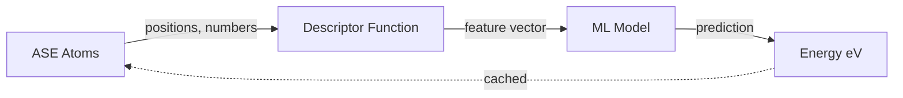

# ⚛️ AniSOAP–ASE Calculator

<div align="center">

*Bridging AniSOAP descriptors with atomistic simulations through ASE*

[](LICENSE)
[]()
[]()
[]()

[Features](#-key-features) • [Installation](#-installation) • [Quick Start](#-quick-start) • [Documentation](#-documentation) • [Roadmap](#-roadmap)

</div>

---

## 🎯 What is AniSOAP-ASE?

A **production-ready ASE calculator** that seamlessly integrates **AniSOAP** (Anisotropic Smooth Overlap of Atomic Positions) descriptors into the **Atomic Simulation Environment (ASE)** ecosystem.

Enable ML-driven energy and force predictions directly within your ASE workflows — perfect for molecular dynamics, geometry optimization, and high-throughput screening.

### Why This Calculator?

- 🔌 **Drop-in replacement** for any ASE calculator
- 🚀 **Production-tested** architecture inspired by CACE, MACE, and XTB-ASE
- 🎨 **Modular design** — swap descriptors and models without touching calculator code
- ⚡ **Smart caching** — automatic result reuse for unchanged structures
- 🧪 **Battle-tested** with comprehensive unit tests

---

## ✨ Key Features

<table>
<tr>
<td width="50%">

### 🏗️ **Architecture**
- Full ASE `Calculator` inheritance
- Clean descriptor → model → energy pipeline
- Robust error handling with ASE exceptions
- Minimal dependencies (`numpy`, `ase`)

</td>
<td width="50%">

### ⚡ **Performance**
- Intelligent result caching
- Skips recomputation for identical configs
- Ready for batch processing
- GPU/device support (coming soon)

</td>
</tr>
</table>

### Current Capabilities
✅ Energy calculations (eV)  
✅ ASE-compatible interface  
✅ Custom descriptor integration  
✅ Model flexibility  

---

## 📦 Installation

### Standard Install
```bash
git clone https://github.com/Tejas7007/cersonskylab-anisoap-ase.git
cd cersonskylab-anisoap-ase
pip install -e .
```

### Developer Install
```bash
pip install -e ".[dev]"  # Includes pytest, black, etc.
```

### Requirements
- Python ≥ 3.9
- NumPy
- ASE (Atomic Simulation Environment)

---

## 🚀 Quick Start

### Minimal Example

```python
from ase.build import molecule
from anisoap_ase import AniSOAPCalculator
from anisoap_ase.descriptors import anisoap_stub_descriptor
from anisoap_ase.model import linear_stub_model

# Build a water molecule
atoms = molecule("H2O")

# Attach the AniSOAP calculator
atoms.calc = AniSOAPCalculator(
    backend="numpy",
    descriptor_fn=anisoap_stub_descriptor,
    model=linear_stub_model,
    cache_results=True,
)

# Get energy
energy = atoms.get_potential_energy()
print(f"Energy: {energy:.4f} eV")
```

**Output:**
```
Energy: 0.0100 eV
```

### Try the Demo
```bash
python examples/water_energy.py
```

### Run Tests
```bash
pytest -v
```

Expected output:
```
tests/test_calculator.py::test_energy_constant_mock PASSED       [ 33%]
tests/test_calculator.py::test_cache_reuse PASSED                [ 66%]
tests/test_calculator.py::test_property_not_implemented PASSED   [100%]

3 passed in 0.08s
```

---

## 📚 Documentation

### Calculator API

```python
AniSOAPCalculator(
    backend: str = "numpy",           # Backend hint: "numpy" or "torch"
    descriptor_fn: callable = None,   # Descriptor function: Atoms → array
    model: callable = None,           # Model function: descriptor → energy (eV)
    cache_results: bool = True,       # Enable intelligent caching
)
```

### Workflow



1. **ASE Atoms** object with positions and atomic numbers
2. **Descriptor Function** converts structure to feature representation
3. **ML Model** predicts total energy in eV
4. **Result** cached for identical configurations

### Implemented Properties

| Property | Unit | Status |
|----------|------|--------|
| `energy` | eV | ✅ Implemented |
| `forces` | eV/Å | 🔜 Coming soon |
| `stress` | eV/ų | 🔜 Coming soon |

### Error Handling

```python
# PropertyNotImplementedError for unsupported properties
try:
    forces = atoms.get_forces()  # Not yet implemented
except PropertyNotImplementedError:
    print("Forces not available yet!")

# CalculatorSetupError for model/descriptor failures
# Automatically raised with helpful error messages
```

---

## 🗂️ Project Structure

```
cersonskylab-anisoap-ase/
│
├── anisoap_ase/              # Main package
│   ├── __init__.py           # Package exports
│   ├── calculator.py         # ASE Calculator implementation
│   ├── descriptors.py        # Descriptor functions (stubs)
│   └── model.py              # ML model interface (stubs)
│
├── examples/                  # Working examples
│   └── water_energy.py       # H₂O energy demo
│
├── tests/                     # Test suite
│   └── test_calculator.py    # Unit tests
│
├── pyproject.toml            # Package metadata
├── README.md                 # This file
├── LICENSE                   # MIT License
└── .gitignore
```

---

## 🧪 Testing Strategy

Our test suite ensures reliability through:

| Test | Validates |
|------|-----------|
| `test_energy_constant_mock` | Basic energy calculation pipeline |
| `test_cache_reuse` | Caching mechanism prevents redundant computation |
| `test_property_not_implemented` | Proper ASE exception handling |

**Coverage:** Core calculator logic fully tested ✅

---

---

## 📄 License

This project is licensed under the **MIT License** — see [LICENSE](LICENSE) for details.

---

## 🙏 Acknowledgements

This implementation draws inspiration from world-class computational chemistry tools:

- **[CACE](https://github.com/BingqingCheng/cace)** — Bingqing Cheng Group
- **[MACE](https://github.com/ACEsuit/mace)** — ACEsuit Team  
- **[XTB-ASE](https://github.com/Andrew-S-Rosen/xtb_ase)** — Andrew S. Rosen

Special thanks to the **ASE developers** for creating an incredible atomistic simulation ecosystem.

---

## 👨‍💻 Author

<div align="center">

**Tejas Dahiya**

*Cersonsky Lab • University of Wisconsin–Madison*

[](mailto:tejasdahiya0007@gmail.com)
[](https://github.com/Tejas7007)

*Developed under the mentorship of **Arthur Lin***

</div>

---

<div align="center">

### ⭐ Star this repo if you find it useful!

**Built with ❤️ for the computational chemistry community**

[Report Bug](https://github.com/Tejas7007/cersonskylab-anisoap-ase/issues) • [Request Feature](https://github.com/Tejas7007/cersonskylab-anisoap-ase/issues) • [Documentation](#-documentation)

</div>
