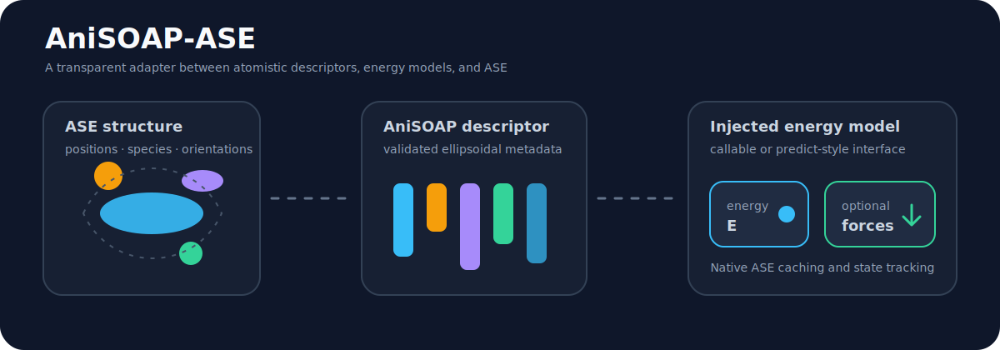
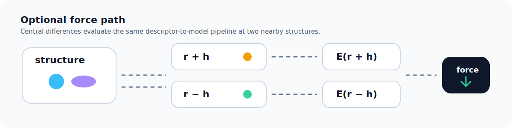

<div align="center">



**An ASE calculator adapter for AniSOAP descriptor-based energy models.**

[Quick start](#quick-start) · [AniSOAP integration](#using-anisoap) · [Force evaluation](#optional-finite-difference-forces) · [Scope](#scope-and-limitations)

</div>

## What this repository provides

AniSOAP-ASE connects three independent pieces without hiding their boundaries:

1. an ASE `Atoms` object;
2. a descriptor callable, with a built-in adapter for AniSOAP;
3. a user-supplied scalar energy model.

The calculator returns energies through ASE and can optionally estimate forces by central finite differences of the complete descriptor-to-model pipeline. It does **not** claim analytical gradients through AniSOAP, and it does not bundle a universal trained potential.

This separation makes the package useful for testing descriptor-based models inside familiar ASE workflows while keeping model provenance and numerical assumptions explicit.

## Quick start

Install the adapter and its test dependencies:

```bash
git clone https://github.com/Tejas7007/cersonskylab-anisoap-ase.git
cd cersonskylab-anisoap-ase
python -m pip install -e ".[test]"
```

A minimal custom descriptor and model can be attached directly:

```python
import numpy as np
from ase import Atoms

from anisoap_ase import AniSOAPCalculator


def position_descriptor(atoms: Atoms) -> np.ndarray:
    return atoms.get_positions().reshape(-1)


def harmonic_energy(features: np.ndarray) -> float:
    return 0.5 * float(features @ features)


atoms = Atoms("H2", positions=[[0.5, 0.0, 0.0], [-0.5, 0.0, 0.0]])
atoms.calc = AniSOAPCalculator(
    descriptor=position_descriptor,
    model=harmonic_energy,
    force_method="central",
)

print(atoms.get_potential_energy())
print(atoms.get_forces())
```

The same example is available in [`examples/harmonic_pipeline.py`](examples/harmonic_pipeline.py).

## Using AniSOAP

The default descriptor adapter lazily imports AniSOAP, validates quaternion and diameter metadata, and computes a flattened power-spectrum feature vector.

Create a pinned development environment with:

```bash
bash scripts/bootstrap.sh
source .venv/bin/activate
```

The bootstrap reconstructs a fixed AniSOAP revision and applies a guarded compatibility edit for the current metatensor block-selection API. The edit is limited to the generated `.worktree/AniSOAP` directory and does not modify this repository or the upstream source.

Then construct the descriptor explicitly:

```python
import numpy as np
from ase import Atoms

from anisoap_ase import AniSOAPCalculator, AniSOAPDescriptor

atoms = Atoms("H2", positions=[[0.0, 0.0, 0.0], [1.0, 0.0, 0.0]])
atoms.set_array("c_q", np.tile([1.0, 0.0, 0.0, 0.0], (2, 1)))

descriptor = AniSOAPDescriptor(default_diameters=(4.0, 4.0, 0.5))

# Replace this illustrative reduction with a trained physical energy model.
def energy_model(features: np.ndarray) -> float:
    return float(features.mean())


atoms.calc = AniSOAPCalculator(descriptor=descriptor, model=energy_model)
energy = atoms.get_potential_energy()
```

`default_diameters` is opt-in. Without it, all three `c_diameter[*]` arrays must already be present. The adapter fills only missing arrays, validates metadata on a copy, and does not mutate the caller's structure.

## Model interface

The calculator accepts either:

- a callable taking one flattened feature vector and returning one scalar; or
- a scikit-learn-style object exposing `predict(X)`.

A small pickle-free `LinearModel` is included for simple deployments. It stores parameters as an `.npz` file and rejects feature-length mismatches instead of padding or truncating descriptors.

```python
import numpy as np
from anisoap_ase import LinearModel

model = LinearModel(coefficients=np.array([0.2, -0.1]), intercept=0.05)
model.save("energy-model.npz")
restored = LinearModel.load("energy-model.npz")
```

## Optional finite-difference forces



Forces are disabled by default. Set `force_method="central"` to evaluate positive and negative coordinate displacements through the full energy pipeline:

```python
calc = AniSOAPCalculator(
    descriptor=descriptor,
    model=energy_model,
    force_method="central",
    finite_difference_step=1e-4,
)
```

This method is transparent and broadly compatible, but it requires `6N` additional energy evaluations for a structure with `N` particles. It is intended for validation and small-system experiments, not high-throughput molecular dynamics.

## Verification

The tests cover:

- ASE energy evaluation with custom descriptor and model callables;
- central finite-difference forces against an analytical harmonic reference;
- native ASE result caching for unchanged structures;
- `predict`-style model support and scalar-output validation;
- quaternion and diameter metadata checks;
- preservation of supplied diameter arrays;
- pickle-free linear-model serialization;
- a pinned upstream AniSOAP integration smoke test.

Run them with:

```bash
pytest -q
```

Static checks:

```bash
ruff check anisoap_ase tests examples
python -m compileall -q anisoap_ase tests examples
```

<details>
<summary><strong>Repository map</strong></summary>

| Path | Purpose |
| --- | --- |
| `anisoap_ase/calculator.py` | ASE energy and optional finite-difference force adapter |
| `anisoap_ase/descriptors.py` | AniSOAP metadata validation and descriptor wrapper |
| `anisoap_ase/model.py` | Model evaluation and secure linear-model storage |
| `examples/` | Minimal custom and AniSOAP integration examples |
| `tests/` | Unit tests for the public API and numerical force path |
| `scripts/bootstrap.sh` | Reconstructs a pinned AniSOAP development environment |

</details>

## Scope and limitations

- This is an adapter and research prototype, not a trained interatomic potential.
- Energy units are determined by the supplied model; ASE convention is electron volts.
- Force units follow from the energy model and Angstrom coordinate displacements.
- Forces use central finite differences, not PyTorch or analytical autodifferentiation.
- Stress, virials, batching, and production molecular-dynamics guarantees are not implemented.
- AniSOAP remains an external upstream dependency and is not redistributed here.

## Provenance and attribution

This repository was developed during a Fall 2025 Open Source Program Office internship with the Cersonsky Lab at the University of Wisconsin-Madison. It builds on the upstream [AniSOAP](https://github.com/cersonsky-lab/AniSOAP) project and uses ASE as its simulation interface.

See [`NOTICE`](NOTICE), [`CITATION.cff`](CITATION.cff), and [`LICENSE`](LICENSE) for attribution and reuse terms.
